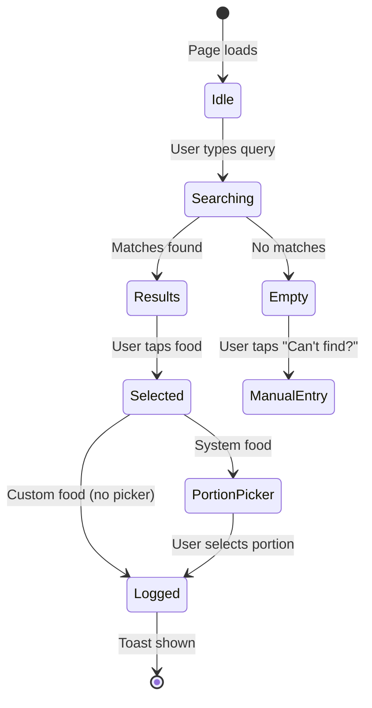
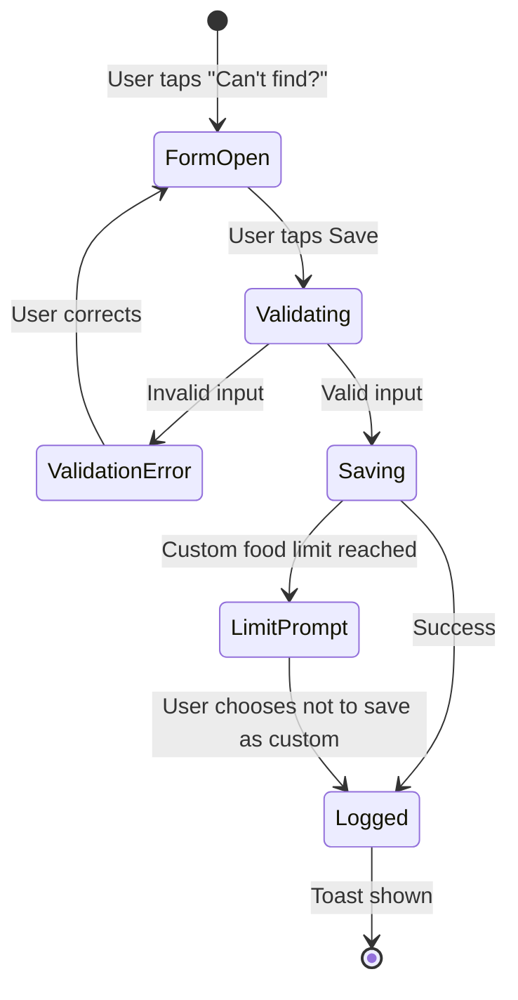
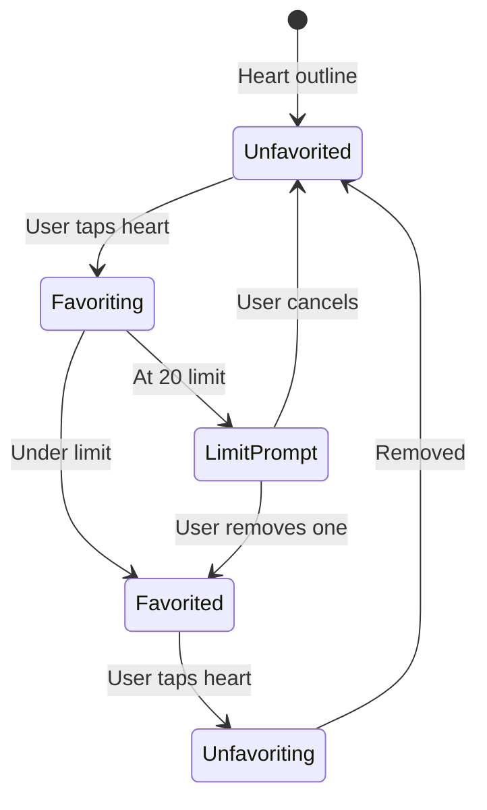
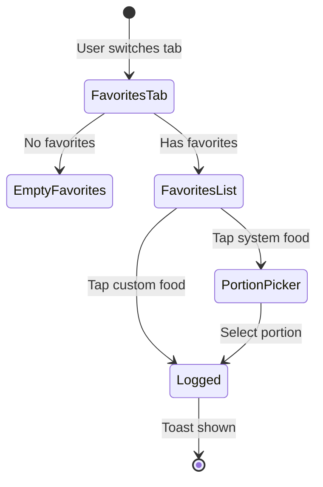
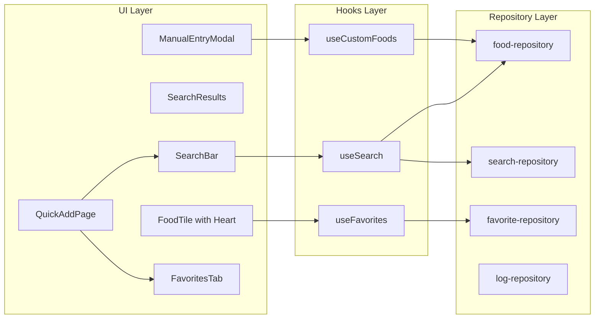

# Food Search, Manual Entry and Favorites Implementation

---

## 1. Feature Definition

**Food Search (F-001, F-002):** Enable users to find foods from the Vietnamese database by typing keywords with instant as-you-type filtering and recent search history, reducing search-to-log time to under 15 seconds.

**Manual Entry (F-003):** Allow users to log foods not found in the database by entering name and nutritional values manually, providing a fallback when search yields no results.

**Custom Foods (F-004, F-005, F-006):** Enable users to save manually-entered foods for reuse (max 30), manage their custom food library (edit/delete), and handle the limit gracefully.

**Favorites (F-007, F-008, F-009):** Enable users to save frequently-eaten foods as favorites (max 20) for one-tap logging, reducing repeat meal logging time to under 5 seconds.

**Recent Items Enhancement (F-010):** Extend the existing Recent section to include manually-entered foods and display source indicators for quick re-logging.

**Target Users:**

- **Linh (Young Professional):** Needs one-tap logging for repeat meals, saves restaurant meals
- **My (Eat-Clean Student):** Values accuracy, creates custom foods for homemade meals
- **Trang (Busy Intern):** Time-constrained, will abandon if logging takes >30 seconds

**Problem Solved:** Currently, logging a meal takes 30+ seconds and repeat meals require navigating the full food grid each time. These features reduce logging time to <15 seconds for new foods and <5 seconds for favorites.

---

## 2. User Flows and States

### Flow 1: Food Search



| State | Description | UI Behaviour |

|-------|-------------|--------------|

| Idle | Search bar empty | Show recent searches as chips (if any) |

| Searching | User typing | Show loading spinner after 150ms debounce |

| Results | Matches found | Display food list with source badges |

| Empty | No matches | Show "No foods found" + Manual Entry link |

| Error | Query too long | Truncate at 50 chars silently |

### Flow 2: Manual Entry



| State | Description | UI Behaviour |

|-------|-------------|--------------|

| FormOpen | Modal visible | Name pre-filled from search query |

| Validating | Form submitted | Disable Save button |

| ValidationError | Invalid data | Inline errors below fields |

| Saving | Processing | Show spinner on Save button |

| LimitPrompt | At 30 custom foods | Dialog with "Manage" option |

### Flow 3: Favorites Toggle



| State | Description | UI Behaviour |

|-------|-------------|--------------|

| Unfavorited | Not in favorites | Outline heart icon |

| Favorited | In favorites | Filled heart icon |

| LimitPrompt | At 20 favorites | Dialog showing current favorites to remove |

### Flow 4: Log from Favorites



---

## 3. Functional Requirements

### FR-001: Search Input

| Rule | Constraint | Behaviour |

|------|------------|-----------|

| FR-001.1 | Query max length | Truncate at 50 characters |

| FR-001.2 | Debounce delay | 150ms before triggering search |

| FR-001.3 | Bilingual matching | Search both `name_vi` and `name_en` |

| FR-001.4 | Case insensitive | "PHO" matches "Phở" |

| FR-001.5 | Special characters | Strip non-alphanumeric (except Vietnamese diacritics) |

### FR-002: Search Results

| Rule | Constraint | Behaviour |

|------|------------|-----------|

| FR-002.1 | Result limit | Max 20 visible, scroll for more |

| FR-002.2 | Ranking | Exact prefix > substring > alphabetical |

| FR-002.3 | Source inclusion | System foods + custom foods combined |

| FR-002.4 | Source badge | Visual indicator for database vs custom |

### FR-003: Recent Searches

| Rule | Constraint | Behaviour |

|------|------------|-----------|

| FR-003.1 | Max items | 5 recent searches (FIFO) |

| FR-003.2 | Persistence | Stored in SQLite `recent_search` table |

| FR-003.3 | Trigger | Saved on successful food selection |

| FR-003.4 | Duplicate handling | Update timestamp, move to top |

### FR-004: Manual Entry Form

| Rule | Constraint | Behaviour |

|------|------------|-----------|

| FR-004.1 | Name required | Non-empty, max 50 chars |

| FR-004.2 | Calories required | Positive integer (>0) |

| FR-004.3 | Macros optional | Non-negative, allow decimals (e.g., 2.5g) |

| FR-004.4 | High calorie warning | Show warning if >5000 kcal |

| FR-004.5 | Pre-fill name | Use failed search query |

### FR-005: Custom Foods

| Rule | Constraint | Behaviour |

|------|------------|-----------|

| FR-005.1 | Max items | 30 per user |

| FR-005.2 | Warning threshold | Toast at 25+ items |

| FR-005.3 | Limit prompt | Dialog at 30 items with "Manage" option |

| FR-005.4 | Duplicate names | Allowed |

| FR-005.5 | Cascade delete | Remove from favorites when deleted |

| FR-005.6 | Undo delete | 5-second window |

### FR-006: Favorites

| Rule | Constraint | Behaviour |

|------|------------|-----------|

| FR-006.1 | Max items | 20 per user |

| FR-006.2 | Warning threshold | Toast at 18+ items |

| FR-006.3 | Limit prompt | Dialog showing favorites to remove |

| FR-006.4 | Debounce toggle | Prevent flicker on rapid taps |

| FR-006.5 | Both types | System and custom foods can be favorited |

### FR-007: Recent Items Enhancement

| Rule | Constraint | Behaviour |

|------|------------|-----------|

| FR-007.1 | Max items | 20 recent items (FIFO) |

| FR-007.2 | Source indicator | Badge for database/custom/manual |

| FR-007.3 | Deleted handling | Show "[Deleted]" badge, use snapshot |

| FR-007.4 | Re-log behaviour | Move to top of recent list |

---

## 4. Data Model and Schema

### Existing Tables (No Changes Required)

```sql
-- Already exists in schema.sql
custom_food (id, user_id, name, kcal, protein, fat, carbs, ...)
favorite (id, user_id, food_type, food_id, sort_order, ...)
recent_search (id, user_id, search_term, searched_at)
food_log (id, user_id, food_type, food_id, portion, name_snapshot, ...)
```

### Data Types

```typescript
// Unified search result type (new)
interface SearchResult {
  id: string
  name: string           // name_vi for system, name for custom
  nameEn?: string        // Only for system foods
  kcal: number           // M portion for system, fixed for custom
  protein: number
  foodType: 'system' | 'custom'
  isFavorited: boolean
}

// Manual entry form data (new)
interface ManualEntryForm {
  name: string
  kcal: number
  protein?: number
  carbs?: number
  fat?: number
  saveAsCustom: boolean
}
```

### Validation Rules

| Field | Type | Validation |

|-------|------|------------|

| `name` | string | Required, 1-50 chars, trimmed |

| `kcal` | number | Required, integer, 1-9999 |

| `protein` | number | Optional, 0-999, 1 decimal |

| `carbs` | number | Optional, 0-999, 1 decimal |

| `fat` | number | Optional, 0-999, 1 decimal |

| `search_term` | string | Required, 1-50 chars, trimmed |

### Data Retention

| Data Type | Retention | Cleanup |

|-----------|-----------|---------|

| Custom foods | Indefinite (soft delete) | Manual only |

| Favorites | Indefinite (soft delete) | Cascade on custom food delete |

| Recent searches | 5 items FIFO | Automatic on insert |

| Food logs | 30 days | Automatic pruning |

---

## 5. UI/UX Requirements

### Component Hierarchy

```
QuickAddPage
├── Header (sticky)
│   ├── Title
│   └── Progress bar
├── SearchBar
│   ├── Input field
│   └── RecentSearchChips
├── TabBar (All | Recent | Favorites)
├── Content (based on active tab + search state)
│   ├── SearchResults (when searching)
│   ├── FoodTileGrid (All tab, no search)
│   ├── RecentSection (Recent tab)
│   └── FavoritesTab (Favorites tab)
├── PortionPicker (bottom sheet)
├── ManualEntryModal (bottom sheet)
├── LimitPrompt (dialog)
└── Toast
```

### Component Specifications

| Component | Props | Behaviour |

|-----------|-------|-----------|

| `SearchBar` | `value`, `onChange`, `recentSearches`, `onRecentClick` | Auto-focus, clear button, recent chips |

| `SearchResults` | `results`, `onSelect`, `onFavoriteToggle` | List with badges, heart icons |

| `ManualEntryModal` | `isOpen`, `onClose`, `onSave`, `prefillName` | Form validation, checkbox |

| `FavoritesTab` | `favorites`, `onSelect`, `onRemove` | Grid with remove option |

| `LimitPrompt` | `type`, `items`, `onSelect`, `onCancel` | Dialog for limit handling |

### Visual Specifications

| Element | Specification |

|---------|---------------|

| Search bar height | 48px (touch target) |

| Tab bar height | 44px |

| Heart icon size | 20px |

| Source badge | 12px pill, muted background |

| Empty state icon | 48px, muted colour |

### Interaction Patterns

| Interaction | Feedback |

|-------------|----------|

| Heart tap | Immediate fill/outline toggle |

| Search typing | 150ms debounce, then results |

| Form submit | Button disabled + spinner |

| Delete custom food | Swipe or tap delete icon |

| Limit reached | Modal blocks further action |

---

## 6. Non-Functional Requirements

### Performance

| Metric | Requirement |

|--------|-------------|

| Search response | < 100ms for 50 system + 30 custom foods |

| Render time | < 16ms per frame (60fps) |

| Initial load | < 500ms for QuickAddPage |

| Database query | < 50ms per operation |

### Security

| Concern | Mitigation |

|---------|------------|

| SQL injection | Parameterised queries (already implemented) |

| XSS | React escaping (default) |

| Data isolation | User ID scoping on all queries |

### Offline Support

| Feature | Offline Behaviour |

|---------|-------------------|

| Search | Works (local SQLite) |

| Manual entry | Works (local storage) |

| Favorites | Works (local storage) |

| Sync | N/A (no cloud in MVP) |

### Localisation

| Element | Approach |

|---------|----------|

| Food names | Bilingual (Vietnamese primary) |

| UI labels | English only for MVP |

| Number formatting | Use `formatNumber()` utility |

| Date/time | Use `date-fns` with locale |

### Accessibility

| Requirement | Implementation |

|-------------|----------------|

| Touch targets | Minimum 44x44px |

| Focus states | Visible ring (existing pattern) |

| Screen reader | ARIA labels on icons |

| Colour contrast | WCAG AA (existing design system) |

---

## 7. Success Criteria and Acceptance Tests

### Success Metrics

| Metric | Target | Measurement |

|--------|--------|-------------|

| Search-to-log time | < 15 seconds | Manual timing test |

| Favorite-to-log time | < 5 seconds | Manual timing test |

| Manual entry completion | < 30 seconds | Manual timing test |

| Search result accuracy | 100% relevant matches | 10 common food queries |

| Feature adoption (favorites) | 30% users save ≥1 favorite | Analytics |

| Feature adoption (custom) | 10% users create ≥1 custom food | Analytics |

### Acceptance Tests

| ID | Test | Expected Result |

|----|------|-----------------|

| AT-001 | Search "phở" | Returns all phở variants, Vietnamese first |

| AT-002 | Search "rice" | Returns rice dishes from `name_en` |

| AT-003 | Empty search + focus | Shows recent search chips |

| AT-004 | Select search result | Saves to recent searches |

| AT-005 | Manual entry with valid data | Logs food, shows toast |

| AT-006 | Manual entry + save as custom | Appears in search results |

| AT-007 | Create 31st custom food | Shows limit prompt |

| AT-008 | Tap heart on food | Toggles favorite status |

| AT-009 | Add 21st favorite | Shows limit prompt with selection |

| AT-010 | Delete favorited custom food | Removes from favorites |

| AT-011 | Re-log from recent | Moves item to top of recent |

| AT-012 | Log deleted custom food from recent | Uses snapshot values |

---

## 8. Analytics Events

### Event Definitions

| Event | Trigger | Parameters |

|-------|---------|------------|

| `search_performed` | User completes search (after debounce) | `query_length`, `result_count`, `has_custom_results` |

| `search_result_selected` | User taps search result | `food_type`, `position_in_results`, `query` |

| `manual_entry_started` | User opens manual entry form | `from_empty_search` |

| `manual_entry_completed` | User saves manual entry | `saved_as_custom`, `has_macros` |

| `custom_food_created` | Custom food saved | `custom_food_count` |

| `custom_food_deleted` | Custom food removed | `was_favorited` |

| `favorite_added` | User favorites food | `food_type`, `favorite_count` |

| `favorite_removed` | User unfavorites food | `food_type`, `favorite_count` |

| `favorite_logged` | User logs from favorites | `food_type`, `time_to_log_ms` |

| `limit_prompt_shown` | User hits 30/20 limit | `limit_type` |

| `limit_prompt_action` | User responds to limit | `action` (manage/cancel) |

### Success Signals

| Signal | Threshold | Indicates |

|--------|-----------|-----------|

| Search-to-log conversion | > 60% | Effective search |

| Manual entry save rate | > 30% as custom | Perceived value |

| Favorites engagement | > 3 favorites/user avg | Feature adoption |

| Repeat favorite usage | > 50% of favorite logs | Time-saving value |

---

## 9. Dependencies, Blockers, and Risks

### Dependencies

| Dependency | Status | Impact |

|------------|--------|--------|

| SQLite schema (custom_food, favorite, recent_search) | Available | None |

| Repository layer (food, favorite, search) | Available | None |

| Toast component | Available | None |

| PortionPicker component | Available | None |

### Blockers

None identified. All required infrastructure exists.

### Risks and Mitigations

| Risk | Likelihood | Impact | Mitigation |

|------|------------|--------|------------|

| Search performance with large datasets | Low | Medium | Limit results to 20, add loading state |

| User confusion between custom and system foods | Medium | Low | Clear visual badges |

| Limit frustration (30 custom, 20 favorites) | Medium | Medium | Warning before limit, clear management UX |

| Form abandonment (manual entry) | Medium | Low | Pre-fill name, minimal required fields |

### Migrations

No database migrations required. Schema already includes all necessary tables.

---

## 10. Implementation Notes for Developers

### Search Implementation

```typescript
// Unified search function in food-repository.ts
async function searchFoods(userId: string, query: string): Promise<SearchResult[]> {
  // 1. Search system_food (existing searchSystemFoods)
  // 2. Search custom_food (existing searchCustomFoods)
  // 3. Merge and rank results
  // 4. Add isFavorited flag from favorites lookup
}
```

### Debouncing Pattern

```typescript
// Use existing pattern from QuickAddPage
const debouncedSearch = useMemo(
  () => debounce((query: string) => performSearch(query), 150),
  [performSearch]
)
```

### Form Validation

```typescript
// Validation in ManualEntryModal
const validateForm = (form: ManualEntryForm): ValidationErrors => {
  const errors: ValidationErrors = {}
  if (!form.name.trim()) errors.name = 'Name is required'
  if (form.kcal <= 0) errors.kcal = 'Calories must be positive'
  if (form.kcal > 5000) errors.kcal = 'warning' // Show warning, don't block
  // macros: allow null, validate non-negative if provided
  return errors
}
```

### Cascade Delete

```typescript
// In food-repository.ts deleteCustomFood
async function deleteCustomFood(id: string): Promise<boolean> {
  // 1. Get custom food to find user_id
  // 2. Remove from favorites (removeFavorite(userId, 'custom', id))
  // 3. Soft delete custom food
}
```

### Testing Checklist

- [ ] Unit tests for search ranking algorithm
- [ ] Unit tests for form validation
- [ ] Integration test: search → select → log
- [ ] Integration test: manual entry → save as custom → appears in search
- [ ] Edge case: 30th custom food
- [ ] Edge case: 20th favorite
- [ ] Edge case: delete favorited custom food

---

## 11. Out of Scope (Explicitly Excluded)

| Item | Rationale |

|------|-----------|

| Cloud sync for favorites | Requires backend (Phase 2) |

| User authentication | CR #1 dependency not yet implemented |

| Barcode scanning | Separate feature initiative |

| Favorites reordering | P1 feature, excluded from MVP |

| Bulk delete custom foods | Low priority, delete one at a time |

| Import/export custom foods | Out of scope for MVP |

| Smart search suggestions | P1 feature |

| Edit logged foods | Can delete via meal list; editing adds complexity |

| Favorites categories/folders | Flat list sufficient for MVP |

| Extended nutritional data (fibre, sugar, sodium) | MVP focuses on core metrics only |

---

## Architecture Overview

The implementation follows the existing patterns: SQLite database with repositories, React components with hooks, and the established toast/modal UX patterns.



## Implementation Phases

### Phase 1: Food Search (F-001, F-002)

Core search functionality with recent search history.

**Files to modify:**

- [`src/components/QuickAdd/QuickAddPage.tsx`](src/components/QuickAdd/QuickAddPage.tsx) - Add search bar, tabs (All/Recent/Favorites)
- [`src/db/repositories/food-repository.ts`](src/db/repositories/food-repository.ts) - Unified search across system + custom foods

**Files to create:**

- `src/components/QuickAdd/SearchBar.tsx` - Search input with recent chips
- `src/components/QuickAdd/SearchResults.tsx` - Filtered results list
- `src/hooks/useSearch.ts` - Search state, debouncing (150ms), recent searches

**Key implementation details:**

- Debounce search input by 150ms (E7)
- Search ranking: exact prefix match first, then substring, then alphabetical
- Include custom foods in results with visual badge
- Pre-fill from failed search when opening Manual Entry

### Phase 2: Manual Entry (F-003)

Bottom sheet form for one-off food logging.

**Files to create:**

- `src/components/QuickAdd/ManualEntryModal.tsx` - Form with validation
- `src/types/manual-entry.ts` - Form state types (if needed)

**Key implementation details:**

- Required: name, calories (>0)
- Optional: protein, carbs, fat (non-negative, allow decimals)
- "Save as custom food" checkbox (unchecked by default)
- Pre-fill name from failed search query
- Logs with `food_type: 'custom'` and generates one-off ID

### Phase 3: Custom Foods (F-004, F-005, F-006)

Save manual entries for reuse; management screen.

**Files to modify:**

- [`src/db/repositories/food-repository.ts`](src/db/repositories/food-repository.ts) - Already has `createCustomFood`, `updateCustomFood`, `deleteCustomFood`

**Files to create:**

- `src/components/Settings/CustomFoodsPage.tsx` - List with edit/delete
- `src/components/Settings/CustomFoodForm.tsx` - Edit form (reuse ManualEntry form logic)
- `src/components/common/LimitPrompt.tsx` - Reusable dialog for 30-item and 20-item limits
- `src/hooks/useCustomFoods.ts` - CRUD operations, limit checks

**Key implementation details:**

- Max 30 custom foods per user (enforced in repository)
- Warning toast at 25+ items ("5 slots remaining")
- Cascade delete: remove from favorites when custom food deleted
- 5-second undo toast for deletions

### Phase 4: Favorites (F-007, F-008, F-009)

Heart icon toggle and Favorites tab on QuickAdd.

**Files to modify:**

- [`src/components/QuickAdd/FoodTile.tsx`](src/components/QuickAdd/FoodTile.tsx) - Add heart icon
- [`src/components/QuickAdd/FoodTileGrid.tsx`](src/components/QuickAdd/FoodTileGrid.tsx) - Add Favorites section/tab
- [`src/db/repositories/favorite-repository.ts`](src/db/repositories/favorite-repository.ts) - Already complete

**Files to create:**

- `src/components/QuickAdd/FavoritesTab.tsx` - Dedicated favorites view
- `src/hooks/useFavorites.ts` - Toggle, list, limit checks

**Key implementation details:**

- Max 20 favorites (enforced in repository)
- Debounce heart tap to prevent flicker (E5)
- Limit prompt shows current favorites to choose which to remove
- Warning at 18+ items ("2 slots remaining")

### Phase 5: Recent Items Enhancement (F-010)

Include manual entries in Recent section with source indicator.

**Files to modify:**

- [`src/components/QuickAdd/FoodTileGrid.tsx`](src/components/QuickAdd/FoodTileGrid.tsx) - Source badges
- [`src/components/QuickAdd/FoodTile.tsx`](src/components/QuickAdd/FoodTile.tsx) - Add source indicator prop

**Key implementation details:**

- Recent items from `food_log` table (already has `food_type` field)
- Source badges: database icon vs "Manual" label vs custom icon
- Deleted custom foods show "[Deleted]" badge, use snapshot values
- Re-logged items move to top of recent list

---

## Testing Plan

### Unit Tests

| Area | Test Cases |

|------|------------|

| Search | Exact match ranking, substring match, bilingual search, empty query, special chars |

| Manual Entry | Validation (empty name, negative calories, decimal macros), high calorie warning |

| Custom Foods | CRUD operations, 30-item limit enforcement, cascade delete to favorites |

| Favorites | Toggle on/off, 20-item limit, debounce rapid taps |

| Recent Items | Source indicator display, snapshot for deleted custom foods |

### Integration Tests

| Flow | Steps |

|------|-------|

| Search to Log | Type query → Select result → Portion picker → Toast with undo |

| Manual Entry | "Can't find?" → Fill form → Save → Toast, verify in logs |

| Custom Food Flow | Manual entry → Check "Save as custom" → Verify in search results |

| Favorites Flow | Heart toggle → Favorites tab → One-tap log |

### Edge Case Tests

- E1: Empty search shows recent searches
- E4: Special characters stripped from query
- E5: Truncate query at 50 chars
- E6: localStorage unavailable fallback
- E7: Rapid typing debounce verification
- Custom food at 30 limit → Prompt shown
- Favorite at 20 limit → Prompt with selection UI
- Custom food in favorites deleted → Cascade removal

### Performance Tests

| Metric | Target |

|--------|--------|

| Search response | < 100ms for 50 items |

| Search-to-selection | < 15 seconds |

| Favorite-to-log | < 5 seconds |

| Heart icon feedback | < 100ms |

---

## Suggested Implementation Order

1. **Phase 1** (Search) first - foundation for other features
2. **Phase 4** (Favorites) second - can be done in parallel, uses existing repository
3. **Phase 2** (Manual Entry) third - builds on search empty state
4. **Phase 3** (Custom Foods) fourth - extends manual entry
5. **Phase 5** (Recent Enhancement) last - integrates all sources