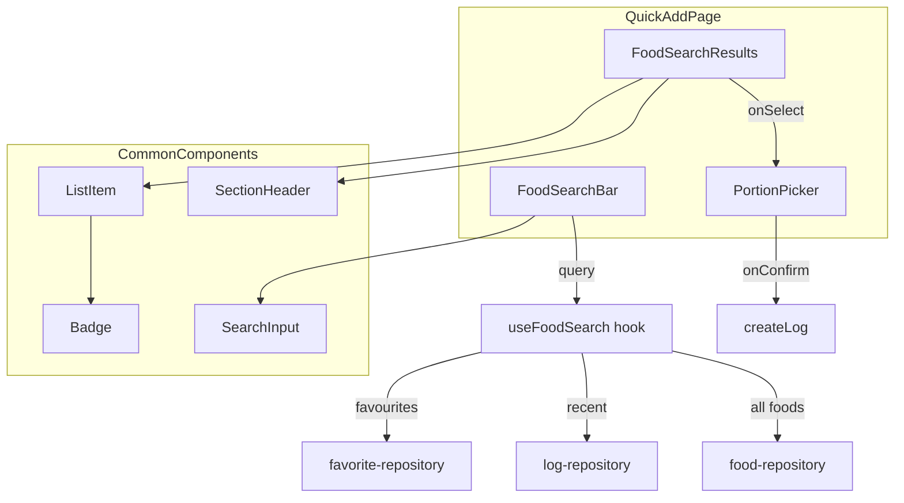

# Food Search Feature Implementation

## Architecture Overview

## Key Files to Modify/Create

### New Common Components

- **New:** `src/components/common/SearchInput.tsx` - Reusable search input with clear button, auto-focus
- **New:** `src/components/common/ListItem.tsx` - Row layout: left slot (emoji/thumbnail) + content (title/subtitle) + right slot (badge/action)
- **New:** `src/components/common/SectionHeader.tsx` - Icon + text header for grouping content
- **New:** `src/components/common/Badge.tsx` - Small chip for counts, portions, status labels
- [`src/components/common/index.ts`](src/components/common/index.ts) - Export new components

### Feature-Specific Files

- [`src/components/QuickAdd/QuickAddPage.tsx`](src/components/QuickAdd/QuickAddPage.tsx) - Add search bar next to heading, manage search state
- **New:** `src/components/QuickAdd/FoodSearchBar.tsx` - Food search wrapper using SearchInput + Cancel button
- **New:** `src/components/QuickAdd/FoodSearchResults.tsx` - Grouped results display (Favourites / Recently Logged / All Foods)
- **New:** `src/components/QuickAdd/FoodSearchResultItem.tsx` - Individual result row using ListItem
- **New:** `src/hooks/useFoodSearch.ts` - Debounced search across favourites, recent logs, and all foods

## Implementation Details

### 1. Common Components

#### SearchInput (`src/components/common/SearchInput.tsx`)

Generic search input for reuse across features:

- **Props:** `value`, `onChange`, `placeholder`, `autoFocus`, `onClear`, `className`
- Search icon (magnifying glass) on the left
- Clear (X) button appears when value is non-empty
- Rounded styling matching design system (`rounded-input`, `bg-gray-10`, subtle border)
- Forwards ref for external focus control
- Keyboard: Escape clears input

#### ListItem (`src/components/common/ListItem.tsx`)

Flexible row component used by `TimelineCard`, `MealCard`, and search results:

- **Props:** `leftSlot` (ReactNode for emoji/thumbnail), `title`, `subtitle`, `rightSlot` (ReactNode for badge/action), `onClick`, `disabled`
- Consistent padding, gap, and alignment
- Interactive variant with hover/active states
- Accessible: proper role, keyboard support

#### SectionHeader (`src/components/common/SectionHeader.tsx`)

Section divider with icon and label:

- **Props:** `icon` (ReactNode or emoji string), `label`, `className`
- Soft styling: muted text, subtle spacing
- Used for "⭐ Favourite Foods", "🕘 Recently Logged", "⏫ All Foods"

#### Badge (`src/components/common/Badge.tsx`)

Small chip for metadata display:

- **Props:** `children`, `variant` (default/primary/muted), `size` (sm/md)
- Used for "Logged 12x", portion sizes ("S", "M", "L"), source labels ("Your food", "Global database")

### 2. FoodSearchBar Component

Thin wrapper around SearchInput:

- Placeholder: "Search food (e.g. chicken rice)"
- Auto-focus on mount
- "Cancel" text button on the right (per design mockup)
- Cancel clears query and blurs input

### 3. Search Hook (`useFoodSearch`)

Queries three data sources in parallel:

- **Favourites:** Filter user's favourites matching query (from [`favorite-repository.ts`](src/db/repositories/favorite-repository.ts))
- **Recently Logged:** Filter last 7 days logs matching query (from [`log-repository.ts`](src/db/repositories/log-repository.ts) `getRecentLogs`)
- **All Foods:** Use existing [`searchSystemFoods`](src/db/repositories/food-repository.ts) for global DB search

Returns grouped results with `logCount` for recently logged items.

### 3. Results Display

- **Group order:** Favourites → Recently Logged → All Foods
- Each group: soft header with icon (heart, clock, arrows)
- Collapsible after 5 items per group (show "Show more" link)
- Hide group entirely if empty
- **Match highlighting:** Wrap matched characters in `<mark>` with subtle styling

### 4. Empty/First-time States

- **No query + no history:** Show all foods A-Z (paginated/virtualized if needed)
- **No results:** Show "No results yet" with "Add custom food" CTA (mocked button only)

### 5. Result Item Interaction

- Tap item → calls `onSelectFood(food)` → opens existing `PortionPicker`
- Recently Logged items show "Logged Nx" badge

### 6. Data Flow

- Reuse existing `FoodItem` type for results
- Convert `SystemFood` → `FoodItem` using existing `toFoodItem` mapper in [`useDatabaseStorage.ts`](src/hooks/useDatabaseStorage.ts)