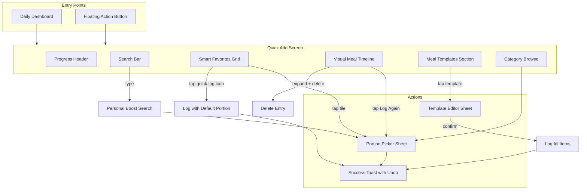

# Quick-Add Feature Enhancement: Implementation Brief

## 1. Overview

This brief details the implementation of an enhanced Quick-Add feature that combines three approaches optimised for different user priorities:

- **Smart Favorites Grid** (Speed): One-tap logging for repeat meals
- **Visual Meal Timeline** (Clarity): Time-based browsing of past meals
- **Meal Templates & Combos** (Accuracy): Log multi-item meals in one action

### Target Personas

| Persona | Primary Need | Feature Focus ||---------|--------------|---------------|| Linh (Young Professional) | Speed, one-tap logging | Smart Favorites Grid || My (Eat-Clean Student) | Accuracy, multi-item meals | Meal Templates || Trang (Busy Intern) | Minimal friction | All features combined |---

## 2. User Flow Overview




### Flow Summary

1. User opens Quick Add from Dashboard or FAB
2. Screen shows: Search bar, Favorites grid, Recent timeline, Templates section
3. **Standard path (2 taps)**: Tap favorite tile -> Select portion -> Done
4. **Fast path (1 tap)**: Tap ⚡ quick-log icon on tile -> Logs with default portion
5. **Template path (2 taps)**: Tap template -> Confirm/edit -> Log all items

---

## 3. Sub-Feature: Smart Favorites Grid

### 3.1 States

| State | Trigger | Behaviour ||-------|---------|-----------|| **Normal** | User has >=1 favorite | Grid displays 4-12 tiles in 2x2 to 3x4 layout || **Empty** | New user, no favorites | Placeholder: "Star foods to add them here" with illustration || **Loading** | Initial data fetch | 4 skeleton tiles with shimmer animation || **Error** | Database read failure | Inline error: "Couldn't load favorites" with retry button || **Reordering** | Edit mode active | Tiles show drag handles, become draggable || **Full** | 20 favorites reached | "Add favorite" CTA hidden; tooltip on attempt |

### 3.2 Functional Requirements

**FR-FAV-01**: Display top 8 favorites above the fold on Quick Add screen

- Grid uses 2-column layout on mobile (<600px)
- 3-column layout on tablet (>=600px)
- Tiles show: Food emoji/icon, Vietnamese name, kcal (M portion)

**FR-FAV-02**: One-tap logging with portion selection

- Tap tile opens PortionPicker bottom sheet
- Pre-select last-used portion for that food

**FR-FAV-03**: Quick-log icon for instant logging

- Each tile shows a small ⚡ icon button in the corner
- Tap icon logs immediately with default portion (M)
- Visual feedback: button scale animation (95% → 100%)
- Toast appears with undo option

**FR-FAV-04**: Dynamic ordering based on frequency

- Algorithm: `score = (log_count_7d * 0.6) + (log_count_30d * 0.3) + (recency_score * 0.1)`
- Recalculate on app open and after each log
- User can override with manual drag-and-drop (via Edit mode)

**FR-FAV-05**: Add to favorites from any food source

- Heart icon on food tiles, search results, timeline items
- Toggle action: tap to add/remove
- Show filled heart when favorited

**FR-FAV-06**: Favorites limit enforcement

- Maximum 20 favorites per user
- When adding 21st: show modal "Remove a favorite to add this one"
- List current favorites with remove buttons

### 3.3 Constraints

- Favorites persist in SQLite `favorite` table (existing schema)
- Sort order stored in `sort_order` column
- Soft delete via `deleted_at` for undo capability

---

## 4. Sub-Feature: Visual Meal Timeline

### 4.1 States

| State | Trigger | Behaviour ||-------|---------|-----------|| **Normal** | Has logged meals | Chronological cards grouped by date || **Empty** | No logs in last 7 days | Placeholder: "Your recent meals will appear here" || **Loading** | Fetching log history | 3 skeleton cards with shimmer || **Error** | Query failure | "Couldn't load history" with retry || **Filtered** | Filter applied | Shows filtered results with clear filter button || **Expanded** | Viewing older items | Infinite scroll loads 7 more days per page |

### 4.2 Functional Requirements

**FR-TL-01**: Display recent meals in reverse chronological order

- Default view: Last 7 days
- Group by date with section headers ("Today", "Yesterday", "Mon 16 Dec")
- Each card shows: Food name, portion, kcal, time logged

**FR-TL-02**: "Log Again" action on each card

- Tap "Log Again" button opens PortionPicker
- Pre-selects same portion as original log

**FR-TL-03**: Filter by meal type (future enhancement placeholder)

- Filter pills: All, Breakfast, Lunch, Dinner, Snacks
- Time-based inference: 6-10am = Breakfast, 11am-2pm = Lunch, etc.

**FR-TL-04**: Search within timeline

- Search icon expands inline search field
- Filters timeline to matching food names
- Case-insensitive, partial match

**FR-TL-05**: Expand-to-delete with undo

- Tap/click timeline card to expand it
- Expanded view shows "Delete" button alongside macros breakdown
- Soft delete, toast with 5-second undo window
- Tap outside or on collapse icon to close expanded view

**FR-TL-06**: Infinite scroll pagination

- Initial load: 7 days
- Scroll to bottom loads next 7 days
- Stop at 30 days (retention limit)

### 4.3 Constraints

- Uses existing `food_log` table
- Respects 30-day retention policy
- Max 30 logs per day limit already enforced

---

## 5. Sub-Feature: Meal Templates & Combos

### 5.1 States

| State | Trigger | Behaviour ||-------|---------|-----------|| **Normal** | Has >=1 template | Template cards displayed in horizontal scroll || **Empty** | No templates created | CTA: "Create your first meal template" || **Loading** | Fetching templates | 2 skeleton cards || **Error** | Database failure | Inline error with retry || **Creating** | "Create template" flow | Full-screen editor sheet || **Editing** | Tap template "Edit" | Editor with pre-filled values || **Logging** | Tap template to log | Confirmation sheet with editable items |

### 5.2 Functional Requirements

**FR-TP-01**: Create meal template from logged items

- After logging, show "Save as template" option
- Select items from today's log to include
- Name the template (e.g., "Usual breakfast")

**FR-TP-02**: Template structure

- Template has: name, list of food items with portions
- Each item: food_id, food_type, portion, is_required
- Optional items can be toggled off when logging

**FR-TP-03**: One-tap template logging

- Tap template card opens confirmation sheet
- Shows all items with checkboxes (required items locked)
- "Log All" button creates multiple food_log entries

**FR-TP-04**: Edit template before logging

- Can adjust portions in confirmation sheet
- Can toggle optional items on/off
- Does not modify template itself

**FR-TP-05**: Template management

- Edit: Change name, add/remove items
- Delete: Soft delete with undo
- Maximum 10 templates per user

**FR-TP-06**: Suggested combos (algorithmic)

- Analyse co-logged items (logged within 30 mins of each other)
- Surface patterns: "You often log coffee + eggs together"
- "Create combo" CTA converts suggestion to template

### 5.3 Constraints

- New `meal_template` and `template_item` tables required (see schema)
- Templates count against storage limits
- Co-logging analysis runs on app open, not real-time

---

## 6. Schema Changes

### 6.1 New Tables

```sql
-- Meal template: reusable multi-item meal definitions
CREATE TABLE IF NOT EXISTS meal_template (
  id TEXT PRIMARY KEY,
  user_id TEXT NOT NULL,
  name TEXT NOT NULL,
  description TEXT,
  total_kcal INTEGER NOT NULL,
  total_protein REAL NOT NULL,
  total_fat REAL NOT NULL,
  total_carbs REAL NOT NULL,
  use_count INTEGER DEFAULT 0,
  last_used_at INTEGER,
  created_at INTEGER NOT NULL,
  updated_at INTEGER NOT NULL,
  deleted_at INTEGER,
  FOREIGN KEY (user_id) REFERENCES user_profile(id) ON DELETE CASCADE
);

-- Template items: individual foods within a template
CREATE TABLE IF NOT EXISTS template_item (
  id TEXT PRIMARY KEY,
  template_id TEXT NOT NULL,
  food_type TEXT NOT NULL CHECK (food_type IN ('system', 'custom')),
  food_id TEXT NOT NULL,
  portion TEXT NOT NULL CHECK (portion IN ('S', 'M', 'L', 'single')),
  name_snapshot TEXT NOT NULL,
  kcal INTEGER NOT NULL,
  protein REAL NOT NULL,
  fat REAL NOT NULL,
  carbs REAL NOT NULL,
  is_required INTEGER DEFAULT 1,
  sort_order INTEGER DEFAULT 0,
  FOREIGN KEY (template_id) REFERENCES meal_template(id) ON DELETE CASCADE
);
```


### 6.2 Schema Updates

Add to `favorite` table:

```sql
-- Track last used portion for smart defaults
ALTER TABLE favorite ADD COLUMN default_portion TEXT DEFAULT 'M';
ALTER TABLE favorite ADD COLUMN use_count INTEGER DEFAULT 0;
ALTER TABLE favorite ADD COLUMN last_used_at INTEGER;
```


### 6.3 Indexes

```sql
-- Optimise template queries
CREATE INDEX IF NOT EXISTS idx_meal_template_user 
ON meal_template(user_id, deleted_at);

CREATE INDEX IF NOT EXISTS idx_template_item_template 
ON template_item(template_id);

-- Optimise favorites frequency calculation
CREATE INDEX IF NOT EXISTS idx_food_log_user_food_date 
ON food_log(user_id, food_id, logged_date);
```


### 6.4 New DB Limits

```typescript
export const DB_LIMITS = {
  // Existing
  MAX_FAVORITES_PER_USER: 20,
  // New
  MAX_TEMPLATES_PER_USER: 10,
  MAX_ITEMS_PER_TEMPLATE: 8,
} as const
```


### 6.5 Validation Rules

| Field | Rule ||-------|------|| Template name | Required, 1-50 characters, trim whitespace || Template items | Minimum 2 items, maximum 8 items || Item portion | Must be valid: S, M, L, or single (for custom foods) || Nutrition values | Non-negative integers/floats |

### 6.6 Data Retention

- Templates: No automatic deletion (user-managed)
- Favorites: Persist indefinitely until user removes
- Timeline data: Follows existing 30-day log retention

---

## 7. UI/UX Requirements

### 7.1 Component List

| Component | Type | Location ||-----------|------|----------|| `FavoritesGrid` | Section | Quick Add screen, top || `FavoriteTile` | Card | Within FavoritesGrid || `TimelineSection` | Section | Quick Add screen, below favorites || `TimelineCard` | Card | Within TimelineSection || `TemplatesSection` | Section | Quick Add screen, horizontal scroll || `TemplateCard` | Card | Within TemplatesSection || `TemplateEditorSheet` | Bottom sheet | Full-screen on mobile || `TemplateConfirmSheet` | Bottom sheet | Half-screen modal || `FavoriteToggle` | Icon button | Food tiles, search results || `EmptyStateIllustration` | SVG | Empty states |

### 7.2 Layout Specification

```javascript
┌─────────────────────────────────────────────┐
│ Quick Add                      [Search 🔍]  │
│ ██████████░░░░ 1,245 / 1,800 kcal           │
├─────────────────────────────────────────────┤
│ ⭐ Favorites                                 │
│ ┌─────────┐ ┌─────────┐ ┌─────────┐ ┌─────┐ │
│ │  Phở bò │ │ Cơm tấm │ │  Café   │ │ ... │ │
│ │ 480 kcal│ │ 650 kcal│ │ 120 kcal│ │     │ │
│ └─────────┘ └─────────┘ └─────────┘ └─────┘ │
├─────────────────────────────────────────────┤
│ 📋 Your Templates           [+ Create]      │
│ ┌──────────────┐ ┌──────────────┐           │
│ │ Usual AM     │ │ Lunch combo  │ ← scroll  │
│ │ 3 items      │ │ 2 items      │           │
│ │ 580 kcal     │ │ 720 kcal     │           │
│ └──────────────┘ └──────────────┘           │
├─────────────────────────────────────────────┤
│ 🕐 Recent                    [See all →]    │
│ ┌───────────────────────────────────────┐   │
│ │ Today                                 │   │
│ │ • Phở bò (M) - 480 kcal      10:30 AM │   │
│ │ • Café sữa đá (S) - 90 kcal   8:15 AM │   │
│ └───────────────────────────────────────┘   │
│ ┌───────────────────────────────────────┐   │
│ │ Yesterday                             │   │
│ │ • Cơm tấm (L) - 750 kcal      1:20 PM │   │
│ └───────────────────────────────────────┘   │
└─────────────────────────────────────────────┘
```


### 7.3 Component Behaviours

**FavoriteTile**

- Size: Min 80x80px, aspect ratio 1:1
- Tap tile body: Opens PortionPicker (responsive modal/drawer)
- Tap ⚡ quick-log icon: Logs with default portion, visual feedback (scale animation)
- Heart icon: Filled when favorited, toggles on click
- Drag handle: Visible only in Edit mode
- Hover state: Subtle elevation/shadow change (desktop only)

**TimelineCard**

- Tap card body: Expands to show macros breakdown + Delete button
- Tap "Log Again" button: Opens PortionPicker with same portion pre-selected
- Expanded state: Shows protein/carbs/fat breakdown, timestamp, Delete button
- Collapse: Tap outside card or tap collapse chevron

**TemplateCard**

- Shows: Name, item count, total kcal, emoji preview
- Tap: Opens TemplateConfirmSheet
- Long-press: Opens edit menu (Edit, Delete)

### 7.4 Interaction Patterns (Web-Optimised)

| Gesture | Component | Action ||---------|-----------|--------|| Click/Tap | FavoriteTile body | Open PortionPicker || Click/Tap | FavoriteTile ⚡ icon | Log with default portion || Drag | FavoriteTile (Edit mode only) | Reorder grid || Click/Tap | TimelineCard body | Expand/collapse card || Click/Tap | TimelineCard "Log Again" | Open PortionPicker || Click/Tap | TimelineCard "Delete" (expanded) | Soft delete with undo || Click/Tap | TemplateCard | Open confirmation modal || Click/Tap | Refresh icon button | Reload data || Hover | FavoriteTile (desktop) | Show elevation shadow || Keyboard | All interactive elements | Tab navigation, Enter to activate |

### 7.5 Typography and Colours

- Follow existing design system in [src/index.css](src/index.css)
- Never use red for calorie numbers (avoid guilt triggers)
- Use neutral colours for exceeded goals
- Consistent 8px grid system

### 7.6 Web Platform Considerations

**Responsive Modals/Sheets:**

- Use `vaul` library or Radix Dialog for bottom drawer behaviour
- Mobile (<768px): Bottom-anchored drawer with drag-to-dismiss
- Desktop (>=768px): Center modal with backdrop click to close

**Hover States (Desktop):**

- FavoriteTile: Subtle shadow/elevation on hover
- TimelineCard: Background highlight on hover
- Buttons: Darken/lighten on hover

**Focus States:**

- Visible focus ring (2px solid primary colour) on all interactive elements
- Skip link for keyboard users to jump to main content

**No Native-Only Features:**

- No haptic feedback (Vibration API unreliable)
- No pull-to-refresh (use refresh button instead)
- No native swipe gestures (use click-to-expand pattern)

**Browser Compatibility:**

- Target: Chrome 90+, Safari 14+, Firefox 90+, Edge 90+
- Progressive enhancement for older browsers

---

## 8. Non-Functional Requirements

### 8.1 Performance

| Metric | Target | Measurement ||--------|--------|-------------|| Time to Interactive | < 1.5s | Lighthouse CI || Favorites grid render | < 100ms | React profiler || Template logging | < 200ms | Console timing || Search response | < 50ms | Debounced, client-side || Scroll performance | 60fps | Chrome DevTools |

### 8.2 Offline Support

- All features must work offline (SQLite local-first)
- Indicate offline status with subtle badge
- Queue no operations (all immediate, no sync)

### 8.3 Security

- No PII stored beyond optional display name
- All data in SQLite, no network requests
- XSS prevention via React's default escaping

### 8.4 Localisation

| Element | Approach ||---------|----------|| Food names | Bilingual: `name_vi` primary, `name_en` secondary || UI strings | Hardcoded Vietnamese for MVP (future: i18n) || Date formats | Vietnamese locale (`date-fns/locale/vi`) || Number formats | Vietnamese (dot as thousands separator) |

### 8.5 Accessibility (Web-Specific)

- Click/touch targets: Minimum 44x44px
- Colour contrast: WCAG AA (4.5:1 for text)
- Screen reader: ARIA labels on all interactive elements
- Reduced motion: Respect `prefers-reduced-motion` media query
- Keyboard navigation: All features accessible via Tab + Enter/Space
- Focus indicators: Visible focus ring on all interactive elements
- Responsive modals: Use `<dialog>` or Radix UI Dialog for proper focus trap
- Drag-and-drop: Keyboard alternative via arrow keys in Edit mode

---

## 9. Success Criteria

### 9.1 Quantitative Metrics

| Metric | Target | Measurement ||--------|--------|-------------|| Favorites adoption | 40% of users add >=1 favorite in week 1 | Analytics || Grid tap ratio | 50% of logs via favorites grid | Log source tracking || Template creation | 15% of users create >=1 template | Analytics || Template usage | Templates account for 20% of logs by power users | Log source || Time to log (repeat meal) | < 5 seconds via favorites | Session timing || Time to log (template) | < 8 seconds | Session timing || Week 1 retention | +10% vs control | Cohort analysis |

### 9.2 Qualitative Criteria

- Users perceive favorites as "their foods"
- Templates feel like "shortcuts", not "complexity"
- Timeline helps users remember "what did I eat?"

### 9.3 Acceptance Tests

**AT-01: Favorites grid population**

- Given: User has logged 10+ meals over 3 days
- When: User opens Quick Add
- Then: Top 8 most frequent foods appear in grid

**AT-02: One-tap logging via quick-log icon**

- Given: User has favorite "Phở bò" with default portion M
- When: User clicks/taps the ⚡ quick-log icon on the tile
- Then: Log created with M portion, toast shows with undo

**AT-03: Template creation**

- Given: User logged "Café" and "Bánh mì" within 5 mins
- When: User taps "Save as template"
- Then: Template created with both items, appears in section

**AT-04: Template logging**

- Given: User has template "Breakfast" with 3 items
- When: User taps template and confirms
- Then: 3 separate logs created, daily summary updates

**AT-05: Timeline "Log Again"**

- Given: User logged "Cơm tấm (L)" yesterday
- When: User finds it in timeline and taps "Log Again"
- Then: PortionPicker opens with L pre-selected

**AT-06: Empty states**

- Given: New user with no data
- When: User opens Quick Add
- Then: Favorites shows "Star foods to add them here"
- And: Timeline shows "Your recent meals will appear here"
- And: Templates shows "Create your first meal template"

---

## 10. Analytics Events

### 10.1 Event Definitions

| Event | Parameters | Success Signal ||-------|------------|----------------|| `favorite_added` | `food_id`, `food_type`, `source` | Engagement || `favorite_removed` | `food_id`, `food_type` | N/A || `favorite_logged` | `food_id`, `portion`, `method` (tap/longpress) | Core KPI || `favorite_reordered` | `from_position`, `to_position` | Engagement || `timeline_log_again` | `food_id`, `days_ago` | Feature utility || `timeline_scrolled` | `depth_days` | Engagement || `template_created` | `item_count`, `total_kcal` | Adoption || `template_logged` | `template_id`, `items_logged`, `items_skipped` | Core KPI || `template_edited` | `template_id`, `change_type` | Iteration || `template_deleted` | `template_id` | Churn signal || `quickadd_section_visible` | `section` (favorites/timeline/templates) | Exposure |

### 10.2 Success Signals

**Leading indicators (Week 1):**

- Favorites added per user > 3
- Grid tap rate > 30%
- Template created by > 10% of users

**Lagging indicators (Week 4+):**

- Time-to-log for repeat meals < 5s
- Weekly retention +10% vs control
- Template logs > 5% of total logs

---

## 11. Dependencies, Blockers, Risks

### 11.1 Dependencies

| Dependency | Status | Impact ||------------|--------|--------|| SQLite database setup | Complete | Schema migrations needed || Existing PortionPicker | Complete | Refactor to use BottomSheet || Existing Toast component | Complete | Reuse || Favorite repository | Complete | Extend for new columns || Log repository | Complete | Add frequency queries || **@radix-ui/react-dialog** | **To install** | Required for BottomSheet primitive || **@dnd-kit/core** | **To install** | Required for drag-and-drop reordering |

### 11.2 Required Migrations

**Migration 2: Favorites enhancement**

```sql
ALTER TABLE favorite ADD COLUMN default_portion TEXT DEFAULT 'M';
ALTER TABLE favorite ADD COLUMN use_count INTEGER DEFAULT 0;
ALTER TABLE favorite ADD COLUMN last_used_at INTEGER;
```

**Migration 3: Meal templates**

```sql
-- Create meal_template table
-- Create template_item table
-- Create indexes
```


### 11.3 Risks

| Risk | Likelihood | Impact | Mitigation ||------|------------|--------|------------|| Cold start (empty favorites) | High for new users | High | Seed with popular foods from region || Template complexity confuses users | Medium | High | Progressive disclosure; hide until user has 5+ logs || Grid feels stale | Medium | Medium | Decay algorithm; "Refresh" prompt after 2 weeks || Performance on low-end devices | Low | Medium | Virtualise timeline list; lazy load templates |

### 11.4 Blockers

- None identified. All dependencies available.

---

## 12. Implementation Notes

### 12.1 File Structure

```javascript
src/
├── components/
│   ├── common/                        # Design system primitives
│   │   ├── index.ts                   # Extend exports
│   │   ├── Toast.tsx                  # Existing
│   │   ├── BottomSheet.tsx            # NEW: Radix Dialog wrapper
│   │   ├── Card.tsx                   # NEW: Base card with variants
│   │   └── IconButton.tsx             # NEW: Icon-only button
│   └── QuickAdd/
│       ├── FavoritesGrid.tsx          # New - uses Card, IconButton
│       ├── FavoriteTile.tsx           # Enhanced - uses Card, IconButton
│       ├── TimelineSection.tsx        # New
│       ├── TimelineCard.tsx           # New - uses Card (expandable)
│       ├── TemplatesSection.tsx       # New
│       ├── TemplateCard.tsx           # New - uses Card
│       ├── TemplateEditorSheet.tsx    # New - uses BottomSheet
│       ├── TemplateConfirmSheet.tsx   # New - uses BottomSheet
│       ├── PortionPicker.tsx          # Refactor - uses BottomSheet
│       └── QuickAddPage.tsx           # Refactor
├── db/
│   └── repositories/
│       ├── favorite-repository.ts     # Extend
│       ├── template-repository.ts     # New
│       └── log-repository.ts          # Add frequency queries
└── hooks/
    ├── useFavorites.ts                # New
    ├── useTimeline.ts                 # New
    └── useTemplates.ts                # New
```


### 12.2 Design System Components (Tier 1)

**Dependency:** `@radix-ui/react-dialog` for BottomSheet

#### BottomSheet (Radix Dialog wrapper)

```typescript
// Responsive drawer: bottom-anchored on mobile, center modal on desktop
interface BottomSheetProps {
  isOpen: boolean
  onClose: () => void
  title?: string
  description?: string
  children: React.ReactNode
  size?: 'auto' | 'half' | 'full'
  showDragHandle?: boolean
}

// Uses Radix Dialog primitives with custom styling
// - Mobile (<768px): position fixed bottom, slide-up animation
// - Desktop (>=768px): centered modal with backdrop
// - Built-in: focus trap, escape key, backdrop click, body scroll lock
```


#### Card

```typescript
interface CardProps {
  children: React.ReactNode
  variant?: 'default' | 'interactive' | 'expandable'
  isExpanded?: boolean
  onPress?: () => void
  disabled?: boolean
  className?: string
}

// Variants:
// - default: bg-background-card rounded-card shadow-card
// - interactive: + hover:shadow-md, active:scale-[0.98], cursor-pointer
// - expandable: + collapsible content area with animation
```


#### IconButton

```typescript
interface IconButtonProps {
  icon: React.ReactNode
  onClick: (e: React.MouseEvent) => void
  'aria-label': string  // Required for accessibility
  variant?: 'default' | 'primary' | 'danger' | 'ghost'
  size?: 'sm' | 'md' | 'lg'  // 32px, 40px, 48px
  disabled?: boolean
}

// Consolidates patterns from: Toast close, MealCard delete, 
// new Quick-log icon, Favorite heart toggle
```


#### Migration: PortionPicker → BottomSheet

```typescript
// Before (custom implementation)
<div className="fixed inset-0 z-50 bg-black/40" onClick={onClose}>
  <div className="absolute bottom-0 ...">
    {/* content */}
  </div>
</div>

// After (using BottomSheet primitive)
<BottomSheet isOpen={isOpen} onClose={onClose} title={food.name_vi}>
  <PortionButtons food={food} onSelect={onSelect} />
</BottomSheet>
```


### 12.2 Key Implementation Details

**Favorites frequency calculation:**

```typescript
// Score = weighted frequency + recency
const calculateFavoriteScore = (
  logCount7d: number,
  logCount30d: number,
  daysSinceLastUse: number
) => {
  const recencyScore = Math.max(0, 1 - daysSinceLastUse / 30)
  return (logCount7d * 0.6) + (logCount30d * 0.3) + (recencyScore * 0.1)
}
```

**Template logging (transactional):**

```typescript
// Log all items in single transaction for consistency
const logTemplate = async (templateId: string, selections: ItemSelection[]) => {
  await runInTransaction(async () => {
    for (const item of selections) {
      if (item.selected) {
        await createLog({ ...item, portion: item.adjustedPortion })
      }
    }
    await incrementTemplateUseCount(templateId)
  })
}
```

**Quick-log icon handler:**

```typescript
// Separate click handlers for tile body vs quick-log icon
const handleTileClick = (e: React.MouseEvent) => {
  // Ignore clicks on the quick-log icon (handled separately)
  if ((e.target as HTMLElement).closest('[data-quick-log]')) return
  openPortionPicker()
}

const handleQuickLog = (e: React.MouseEvent) => {
  e.stopPropagation() // Prevent tile click bubbling
  // Visual feedback via CSS :active state (scale 95%)
  logWithDefaultPortion()
}
```

**Edit mode toggle for reordering:**

```typescript
const [isEditMode, setIsEditMode] = useState(false)

// Use @dnd-kit/core for accessible drag-and-drop
// Drag handles only visible when isEditMode is true
// Keyboard: Arrow keys to move, Enter/Space to drop
```


### 12.3 Testing Strategy

| Type | Coverage | Tools ||------|----------|-------|| Unit | Repository functions, score calculation | Vitest || Component | Tile interactions, modal states | React Testing Library || E2E | Full logging flows, keyboard navigation | Playwright || Accessibility | ARIA labels, focus management | axe-core, manual || Responsive | Mobile/tablet/desktop breakpoints | Playwright viewports || Cross-browser | Chrome, Safari, Firefox, Edge | Playwright |---

## 13. Out of Scope

| Item | Rationale ||------|-----------|| Cloud sync | No backend; local-first architecture || Template sharing | Single-user app; no social features || AI-powered suggestions | Complexity; algorithm-based for MVP || Photo attachment to meals | Separate feature initiative || Meal time categories (Breakfast/Lunch) | Not MVP; time-inference too error-prone || Voice logging | Separate accessibility initiative || Barcode scanning | Separate feature (CR #3) || Nutritional details beyond kcal/protein/carbs/fat | MVP focuses on core metrics || Template scheduling/reminders | Future enhancement || Favorites folders/categories | Flat list for MVP; iterate based on feedback |---

## 14. Open Questions

| Question | Default if Unresolved ||----------|----------------------|| Should templates show thumbnail previews? | No - use emoji list instead || Should we animate favorites grid reorder? | Yes - subtle scale animation || What happens when logging template at daily limit? | Log as many as possible, show warning || Should timeline show photos if available? | Defer to Phase 2 |---

## Summary

This implementation adds three complementary features to Quick-Add:

1. **Smart Favorites Grid**: Zero-friction logging for repeat meals (covers ~50% of logs)
2. **Visual Meal Timeline**: Time-based browsing for "what did I eat?" queries (~30% of logs)