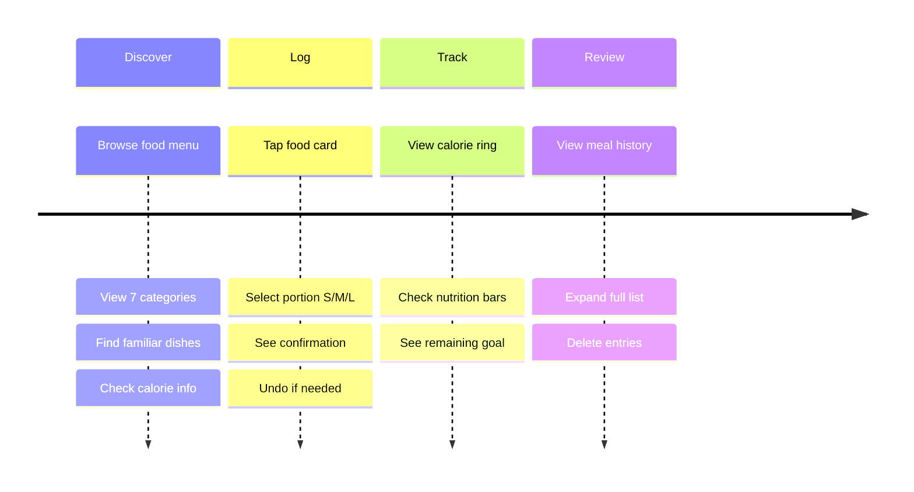

# User Journey Map - v0

## Overview

**Product:** Calo Tracker - A calorie tracking app made for Vietnamese users
**Who it's for:** Young adults (18-25) who want to track meals without the hassle
**Our promise:** Log your meal in under 30 seconds with familiar Vietnamese foods

---

## Journey Map

### Stage 1: Discover

| Aspect | Details |
|--------|---------|
| **What you want** | Find the food you just ate |
| **How you feel** | Engaged, looking for something familiar |
| **What you do** | 1. Browse the food menu |
|  | 2. View 7 food categories |
|  | 3. Find familiar dishes |
|  | 4. Check calorie info |

**Food categories you'll find:**
- 🍜 Noodles (phở, bún bò Huế, hủ tiếu)
- 🍚 Rice dishes (cơm, cơm tấm)
- 🥖 Bánh Mì
- 🍿 Snacks
- 🧃 Drinks (trà sữa, beverages)
- 🍰 Desserts
- 🥗 Healthy options

---

### Stage 2: Log

| Aspect | Details |
|--------|---------|
| **What you want** | Record your meal quickly |
| **How you feel** | Ready to go, want it done fast |
| **What you do** | 1. Tap food card |
|  | 2. Select portion S/M/L |
|  | 3. See confirmation |
|  | 4. Undo if needed |

---

### Stage 3: Track

| Aspect | Details |
|--------|---------|
| **What you want** | See how you're doing today |
| **How you feel** | Informed, motivated |
| **What you do** | 1. View calorie ring |
|  | 2. Check nutrition bars |
|  | 3. See remaining goal |

**What you'll see:**
- A green calorie ring that fills up as you eat
- Protein bar (green) - 75g daily goal
- Carbs bar (yellow) - 200g daily goal
- Fat bar (purple) - 60g daily goal

---

### Stage 4: Review

| Aspect | Details |
|--------|---------|
| **What you want** | See everything you ate today |
| **How you feel** | Reflective, keeping yourself accountable |
| **What you do** | 1. View meal history |
|  | 2. Expand full list |
|  | 3. Delete entries |

---

## Quick Reference

| Stage | What you do | How long |
|-------|-------------|----------|
| Discover | Browse menu, find food | 5-10 sec |
| Log | Tap food, pick portion | 5-10 sec |
| Track | Check calorie ring and bars | 3-5 sec |
| Review | See meal history | As needed |

**Goal:** Log any meal in under 30 seconds

